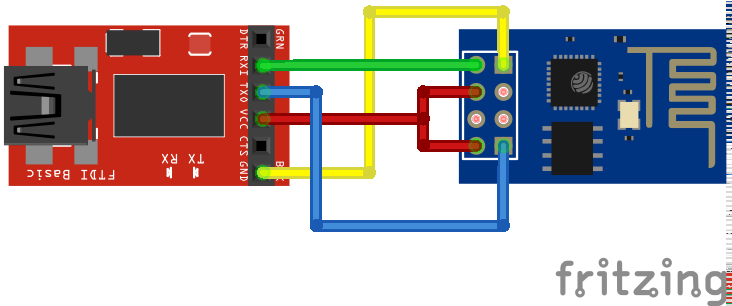

# How to connect to an ESP8266 module


## You will need:

- ESP8266 module.
- USB to serial UART adapter, for instance an FT232RL board.
- USB to micro USB cable.
- Female-to-female dupont wires or other connectors.


## Layout

Connect pins on the adapter to those on the module in the following configuration, then 

| USB to serial adapter | ESP-xx module |
| --------------------- | ------------- |
| 3.3v                  | 3.3v, CH_PD   |
| GND                   | GND           |
| Tx                    | Rx            |
| Rx                    | Tx            |


### ESP-01



## Communicating

Once your module is connected and plugged into your machine, you should be able to communicate with module using a serial terminal.

Your serial terminal application should be configured with the following settings:

- Baud rate: 9600
- Data bits: 8
- Stop bits: 1
- Parity: none


## Testing

If you have Lua firmware installed on the module and the module is correctly connected and the software setup correctly, you should see the characters that you type in the terminal echoed back to you. 

If this is the case, what you are actually doing here is talking to the Lua REPL (read-eval-print loop) on the module. Try typing the following, followed by enter:

```lua
print 'hello'
```

You should see `hello` appear on the line below. If you do, you're connected. 

